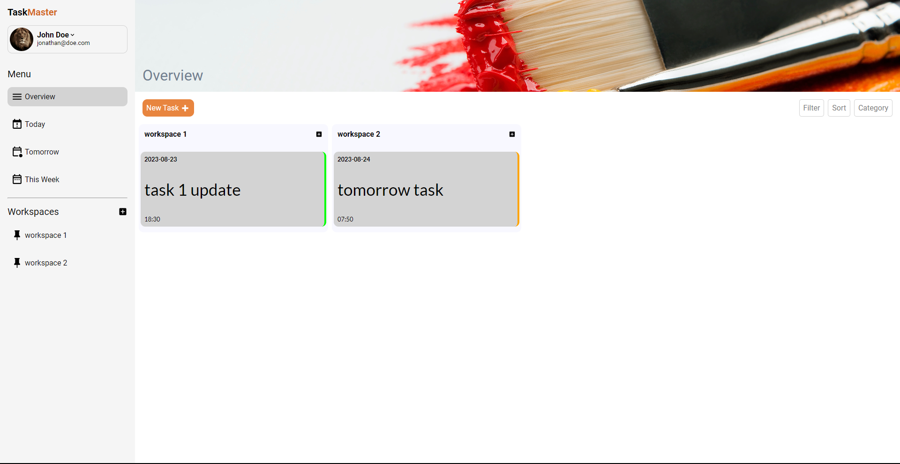
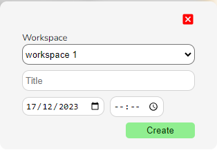
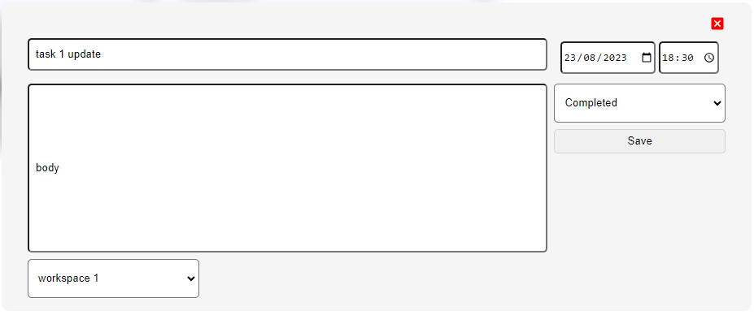
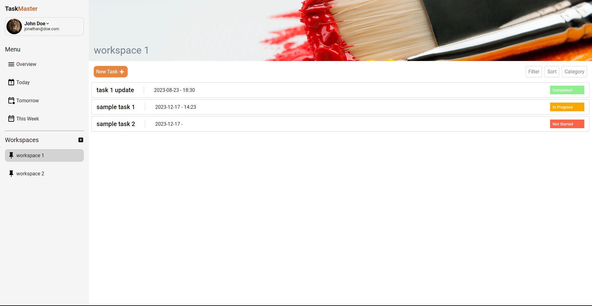

# Task Master
This is a simple todo-list application made as part of [The Odin Project](https://www.theodinproject.com/dashboard) Javascript exercises. It is intended to demonstrate mastery of the [S.O.L.I.D](https://wearecommunity.io/communities/epam-poland/articles/1190#:~:text=your%20systems%20correctly.-,SOLID%20is%20an%20acronym%20for%20five%20main%20principles%20of%20Object,principle%20and%20dependency%20inversion%20principle.) object oriented programming principles and local storage manipulation using javascript

Check out the live demo [here](https://edgarmuyomba.github.io/task-master/)

## Features
1. Grouping tasks under workspaces
2. Creation and modification of tasks
3. Task tracking using the `Not Started`, `In Progress` and `Completed` states
4. Default classification using `today`, `tomorrow` and `this week`

## Screenshots
Home page



Creating a new task



Modifying a task



Work space view



## Setting up dev
1. Clone the repository into the desired directory
   ```
   git clone https://github.com/edgarmuyomba/task-master.git
   ```
2. Enter the created folder `task-master` using the terminal
3. Install the necessary dependencies
   ```
   npm install
   ```
4. Run the local demo and acccess it on [localhost:8080](localhost:8080)
   ```
   npm start
   ```

## Built using 
1. html, css, javascript
2. [date-fns](https://www.npmjs.com/package/date-fns)
3. [webpack](https://webpack.js.org/)